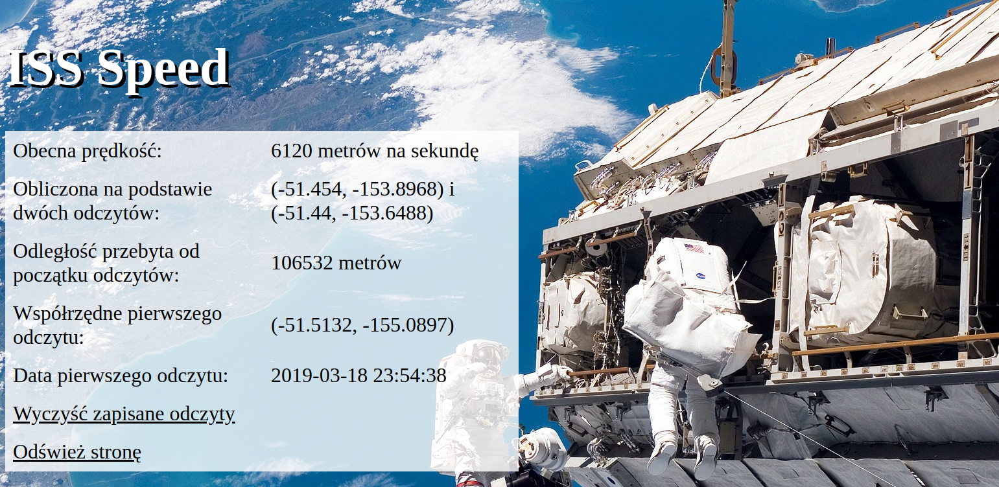

# ISS-speed

[intive Patronage 2019 - Wrocław](https://www.facebook.com/events/804318863254981/)

Zadanie kwalifikacyjne programu edukacyjnego.
Odpytuje API o pozycję stacji, zapisując jednocześnie w sesji pierwszy odczyt.

Użyte technologie:

-   Spring Boot
-   Jackson
-   SimpleLatLng
-   Thymeleaf
-   Lombok

# Screenshot:

# [Live Demo: https://pawilojc.pl/iss-speed](https://pawilojc.pl/iss-speed "ISS Speed live demo")
